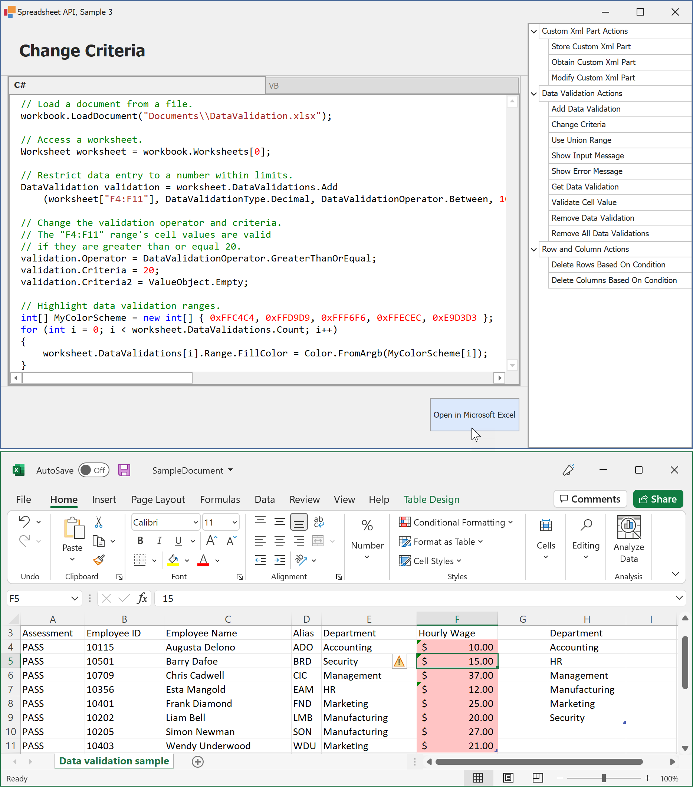

<!-- default badges list -->

<!-- default badges end -->

# Spreadsheet Document API – How to Process Excel Workbooks in Code (Part 3)

The [DevExpress Spreadsheet Document API](https://docs.devexpress.com/OfficeFileAPI/14912/spreadsheet-document-api) is a non-visual library that allows you to generate, import, export, modify, and print Microsoft Excel workbooks in code. 

> You need a license for the [DevExpress Office File API Subscription](https://www.devexpress.com/products/net/office-file-api/) or [DevExpress Universal Subscription](https://www.devexpress.com/subscriptions/universal.xml) to use this library in production code. 

This example demonstrates how to use the Spreadsheet Document API to execute the following actions:

- Embed arbitrary XML data (custom XML parts) in a spreadsheet document
- Validate data in worksheet cells
- Remove rows and columns that meet a specific condition

The application form contains the list of supported operations and the editor that allows you to view and edit the source code for each operation. Select an operation, modify its code if necessary, and click **Open in Microsoft Excel** to open the resulting spreadsheet document in Microsoft Excel.

If an error occurs during compilation or execution, the background color of the code editor changes to pink.

<!-- default file list -->

## Files to Look At

* [CustomXmlPartActions.cs](./CS/Spreadsheet_Document_Api_Part_3/CodeExamples/CustomXmlPartActions.cs) (VB: [CustomXmlPartActions.vb](./VB/Spreadsheet_Document_Api_Part_3/CodeExamples/CustomXmlPartActions.vb))
* [DataValidationActions.cs](./CS/Spreadsheet_Document_Api_Part_3/CodeExamples/DataValidationActions.cs) (VB: [DataValidationActions.vb](./VB/Spreadsheet_Document_Api_Part_3/CodeExamples/DataValidationActions.vb))
* [RowAndColumnActions.cs](./CS/Spreadsheet_Document_Api_Part_3/CodeExamples/RowAndColumnActions.cs) (VB: [RowAndColumnActions.vb](./VB/Spreadsheet_Document_Api_Part_3/CodeExamples/RowAndColumnActions.vb))

<!-- default file list end -->

## Documentation

- [Custom XML parts](https://docs.devexpress.com/OfficeFileAPI/DevExpress.Spreadsheet.Workbook.CustomXmlParts)
- [Validate Data in Spreadsheet Cells](https://docs.devexpress.com/OfficeFileAPI/401430/spreadsheet-document-api/data-validation)
- [Remove Rows](https://docs.devexpress.com/OfficeFileAPI/DevExpress.Spreadsheet.RowCollection#remove-rows-that-meet-a-specific-condition)
- [Remove Columns](https://docs.devexpress.com/OfficeFileAPI/DevExpress.Spreadsheet.ColumnCollection#remove-columns-that-meet-a-specific-condition)

## More Examples

- [Spreadsheet Document API - Part 1](https://github.com/DevExpress-Examples/spreadsheet-document-api-examples-part1)
- [Spreadsheet Document API - Part 2](https://github.com/DevExpress-Examples/spreadsheet-document-api-examples-part2)
<!-- feedback -->
## Does this example address your development requirements/objectives?

 

(you will be redirected to DevExpress.com to submit your response)
<!-- feedback end -->
